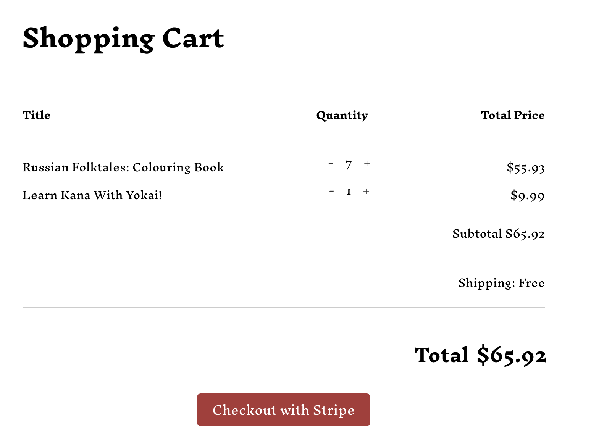

# Bookstore E-commerce Website

## Overview

This project is a dynamic, bilingual (English/Russian) e-commerce website for a small book-printing startup. It serves as a comprehensive portfolio piece, showcasing my skills in full-stack development using the MERN stack (MongoDB, Express, React, Node.js) with the addition of MySQL for data management. The site is designed to provide a seamless and interactive user experience while also supporting dynamic language toggling and a secure checkout process.

## Features

- **Bilingual Support (English/Russian):** Toggle between English and Russian seamlessly using the dynamic language switcher.
- **Dynamically Generated Carousel:** The homepage features a carousel that updates dynamically with book data fetched from the Node.js/Express.js backend.
- **Book Details Page:** Clicking on a book in the carousel redirects to a dedicated page with dynamically filled details from the backend. Users can either purchase the book via an Amazon link or add it to the cart for direct purchase through the company.
- **Secure Checkout:** Uses the Stripe API for handling purchases securely and efficiently.
- **MySQL Integration:** Book data and language content are stored and retrieved from a MySQL database.
- **Responsive Design:** The site is fully responsive, designed to be accessible and user-friendly on both desktop and mobile devices.
- **Tech Stack:**
  - Frontend: React, TypeScript
  - Backend: Node.js, Express.js, MySQL
  - Payment Gateway: Stripe API, NodeMail API

## Current Status

The project is currently under development as part of my senior year portfolio. Features still in progress include:

- Search and category filtering functionality
- Complete Russian versions of cart and about us pages
- Improved styling of the cart page

## Why This Project Stands Out

Unlike many other new graduate portfolio projects, this e-commerce site demonstrates my ability to create real-world applications with a full-stack approach. By integrating bilingual support and a dynamic carousel linked to a backend server, the project showcases my versatility in both frontend and backend development. Additionally, incorporating the Stripe API for secure transactions highlights my understanding of integrating third-party services.

## Future Improvements

After completing the core functionality and styling, I plan to further enhance the user experience by:

- Implementing advanced search and filtering
- Adding more localized content for Russian users
- Optimizing the checkout process with order tracking

## Contact

For any questions or feedback, feel free to reach out via email or through my LinkedIn profile.

Thank you for checking out my project!
